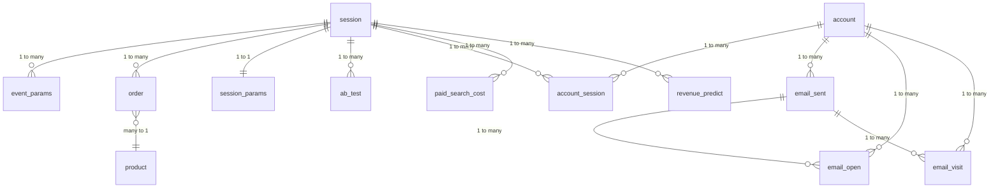

# Database Schema — Data Analytics Mate

Dataset: `data-analytics-mate.DA`

This database contains information about an online store: user registrations and orders, user actions on the site, email communications sent to users, etc.

## Entity-Relationship Diagram

---

## Tables Overview

| Table | Description |
|-------|-------------|
| `session` | Main table. Each user visit = one session with unique `ga_session_id`. |
| `session_params` | Session details: device, country, browser, traffic channel. |
| `event_params` | All user actions during the session (clicks, views, etc.). |
| `ab_test` | Which A/B tests the session was involved in and which group (1=A, 2=B). |
| `account` | Subscribers who left their email. Contains verification and unsubscribe status. |
| `account_session` | Junction table between account and session. Shows which session the user subscribed in. |
| `email_sent` | All sent emails. `sent_date` is days after account creation, not the actual date. |
| `email_open` | Each email open. One email can be opened multiple times. |
| `email_visit` | Each click in an email. Can repeat for the same email. |
| `order` | Purchases. Each row = one purchased product in a session. Joins to product via `item_id`. |
| `product` | Product catalog: name, category, price. Does not contain sales data — only characteristics. |
| `revenue_predict` | Company revenue targets by date. For comparing actual vs planned. |
| `paid_search_cost` | Paid traffic costs by date. For calculating ROI and ad effectiveness. |

---

## Table Definitions

### session

User sessions table.

| Column | Type | Description |
|--------|------|--------------|
| `ga_session_id` | INTEGER | Unique session identifier (PK) |
| `date` | DATE | Session date |

**Primary Key:** `ga_session_id`

---

### session_params

Additional information about sessions.

| Column | Type | Description |
|--------|------|--------------|
| `ga_session_id` | INTEGER | Unique session identifier (FK → session) |
| `device` | VARCHAR(255) | Device type (desktop, mobile, tablet) |
| `mobile_model_name` | VARCHAR(255) | Mobile device model name |
| `operating_system` | VARCHAR(255) | Device operating system |
| `language` | VARCHAR(255) | Browser language |
| `browser` | VARCHAR(255) | Browser name |
| `continent` | VARCHAR(255) | Continent where the user's country is located |
| `country` | VARCHAR(255) | User's country by IP |
| `medium` | VARCHAR(255) | Traffic source identifier |
| `name` | VARCHAR(255) | Additional info about traffic source |
| `channel` | VARCHAR(255) | General traffic channel |

**Primary Key:** `ga_session_id`  
**Foreign Key:** `ga_session_id` → `session(ga_session_id)`

---

### event_params

Table of events that occurred during user sessions.

| Column | Type | Description |
|--------|------|--------------|
| `event_date` | DATE | Event date |
| `ga_session_id` | INTEGER | Unique session identifier (FK → session) |
| `event_timestamp` | INTEGER | Event date and time |
| `event_name` | VARCHAR(255) | Event name |
| `event_params` | JSONB | Parameters describing the event |

**Foreign Key:** `ga_session_id` → `session(ga_session_id)`

---

### ab_test

Table identifying which A/B tests the user's first session was part of.

| Column | Type | Description |
|--------|------|--------------|
| `ga_session_id` | INTEGER | Session identifier (FK → session) |
| `test` | INTEGER | A/B test sequential number |
| `test_group` | INTEGER | Group number in AB test (1 — A, 2 — B) |

**Foreign Key:** `ga_session_id` → `session(ga_session_id)`

---

### account

Site subscribers table. A subscriber is a user who left their email for communication.

| Column | Type | Description |
|--------|------|--------------|
| `id` | INTEGER | Unique subscriber identifier (PK) |
| `send_interval` | INTEGER | Interval during which the user wants to receive emails |
| `is_verified` | INTEGER | Whether user confirmed their email (0 - not verified, 1 - verified) |
| `is_unsubscribed` | INTEGER | Whether user unsubscribed from mailing (0 - not unsubscribed, 1 - unsubscribed) |

**Primary Key:** `id`

---

### account_session

Table with information about the session in which the subscription was created.

| Column | Type | Description |
|--------|------|--------------|
| `account_id` | INTEGER | Subscriber identifier (FK → account) |
| `ga_session_id` | INTEGER | Session identifier (FK → session) |

**Foreign Keys:**  
- `account_id` → `account(id)`  
- `ga_session_id` → `session(ga_session_id)`

---

### email_sent

Table with list of emails sent to users. The same `id_message` can be sent multiple times if previous sending was unsuccessful.

| Column | Type | Description |
|--------|------|--------------|
| `sent_date` | INTEGER | Number of days after account creation when the email was sent. For example, if user created account on 01/01/2020 and email was sent on 01/15/2020, sent_date will be 14. |
| `letter_type` | INTEGER | Email type — each number is a separate message type |
| `id_message` | VARCHAR(255) | Message identifier (can repeat on resend) |
| `id_account` | INTEGER | Subscriber identifier (FK → account) |

**Foreign Key:** `id_account` → `account(id)`

---

### email_open

Table with list of emails opened by the user. One email can be opened multiple times.

| Column | Type | Description |
|--------|------|--------------|
| `open_date` | INTEGER | Number of days after account creation when email was opened |
| `letter_type` | INTEGER | Email type |
| `id_message` | VARCHAR(255) | Unique email identifier |
| `id_account` | INTEGER | Unique subscriber identifier (FK → account) |

**Foreign Key:** `id_account` → `account(id)`

---

### email_visit

Table with list of emails where the user clicked. Clicks can repeat within the same email.

| Column | Type | Description |
|--------|------|--------------|
| `visit_date` | INTEGER | Number of days after account creation when the click occurred |
| `letter_type` | INTEGER | Email type |
| `id_message` | VARCHAR(255) | Unique email identifier |
| `id_account` | INTEGER | Unique subscriber identifier (FK → account) |

**Foreign Key:** `id_account` → `account(id)`

---

### order

Orders table. Within one session, multiple products can be purchased.

| Column | Type | Description |
|--------|------|--------------|
| `id` | BIGINT | Unique order identifier (PK, auto-generated) |
| `ga_session_id` | INTEGER | Session identifier (FK → session) |
| `item_id` | INTEGER | Product identifier (FK → product) |

**Primary Key:** `id`  
**Foreign Keys:**  
- `ga_session_id` → `session(ga_session_id)`  
- `item_id` → `product(item_id)`

---

### product

Products catalog table.

| Column | Type | Description |
|--------|------|--------------|
| `item_id` | INTEGER | Product identifier (PK) |
| `name` | VARCHAR(255) | Product name |
| `category` | VARCHAR(100) | Product category |
| `price` | DECIMAL(10,2) | Price, USD |
| `short_description` | TEXT | Short product description |

**Primary Key:** `item_id`

---

### revenue_predict

Table with company revenue target plans.

| Column | Type | Description |
|--------|------|--------------|
| `date` | DATE | Prediction date (PK) |
| `predict` | DECIMAL(10,2) | Revenue prediction, USD |

**Primary Key:** `date`

---

### paid_search_cost

Table showing costs of acquiring paid traffic.

| Column | Type | Description |
|--------|------|--------------|
| `date` | DATE | Cost date (PK) |
| `cost` | DECIMAL(10,2) | Cost amount |

**Primary Key:** `date`

---

## Relationships Summary

| From | To | Relationship |
|------|----|---------------|
| `session` | `session_params` | 1:1 (via ga_session_id) |
| `session` | `event_params` | 1:many |
| `session` | `order` | 1:many |
| `session` | `ab_test` | 1:many |
| `session` | `account_session` | 1:many |
| `account` | `account_session` | 1:many |
| `account` | `email_sent` | 1:many |
| `account` | `email_open` | 1:many |
| `account` | `email_visit` | 1:many |
| `order` | `product` | many:1 (via item_id) |

---

## Notes

> **Important:** As a unique session identifier we use the `ga_session_id` field to simplify problem-solving logic. Later, when solving more complex tasks, you may notice that one session can have multiple metadata and sometimes aggregate data may not match for some dimensions.