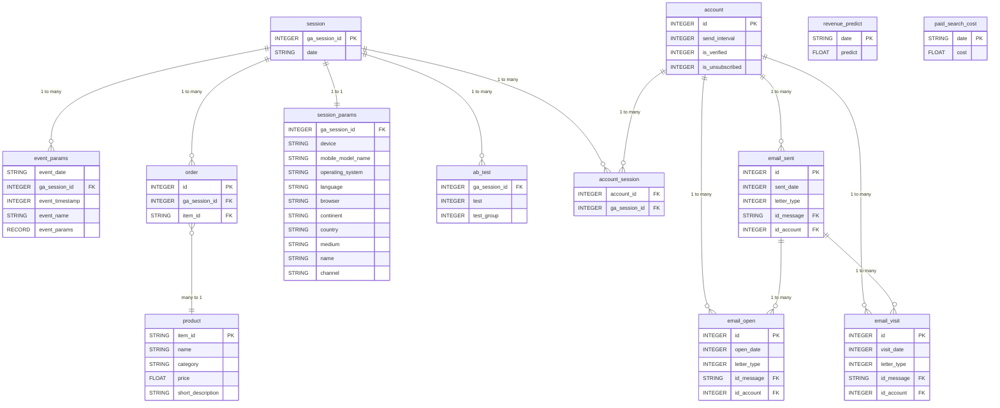

# SQL Extra

Проєкт для вивчення SQL на реалістичних даних веб-аналітики. Містить 15+ SQL файлів із завданнями різної складності — від базових SELECT до віконних функцій та CTE.

Дані автоматично генеруються при першому запуску, щоб одразу почати писати запити.

## Структура проєкту

| Папка | Вміст |
|---|---|
| `http/` | HTTP запити для тестування REST API (JetBrains HTTP Client) |
| `sql/` | SQL запити для виконання — 15 файлів |
| `src/main/java/.../controller/` | REST контролери (13 файлів) |
| `src/main/java/.../entity/` | JPA сутності (13 таблиць) |
| `src/main/java/.../repository/` | Spring Data JPA репозиторії |
| `src/main/java/.../service/` | Бізнес-логіка |
| `src/main/java/.../mapper/` | MapStruct мапери Entity ↔ DTO |
| `src/main/java/.../config/DataSeeder.java` | Генератор тестових даних |
| `src/main/resources/db/changelog/` | Liquibase міграції — DDL створення таблиць |
| `src/main/resources/static/db_schema_full.html` | Інтерактивна ERD схема |

## Технології

| Технологія | Призначення |
|---|---|
| Spring Boot 3.3 | Каркас додатку |
| Spring Data JPA | ORM (Entity → Repository) |
| Liquibase | Міграції бази даних (DDL) |
| PostgreSQL 17 | База даних |
| MapStruct 1.6 | Мапінг Entity ↔ DTO |
| Lombok | Гетери, сетери, конструктори |
| DataFaker 2.4 | Генерація тестових даних |

## Налаштування даних

При першому запуску додаток автоматично наповнює базу даних. Кількість записів можна змінити через `.env` файл у корені проєкту:

| Змінна | За замовчуванням | Опис |
|---|---|---|
| `SEEDER_PRODUCTS` | 500 | Кількість товарів |
| `SEEDER_SESSIONS` | 2000 | Кількість сесій |
| `SEEDER_ACCOUNTS` | 1000 | Кількість акаунтів |

### Що створюється при старті

| Таблиця | Скільки | Деталі |
|---|---|---|
| **products** | `SEEDER_PRODUCTS` | Випадкові назви, 10 категорій, ціни, описи з розмірами |
| **sessions** | `SEEDER_SESSIONS` | Унікальний `ga_session_id`, випадкова дата за останні 90 днів |
| **session_params** | 1 на сесію | Пристрій, браузер, ОС, країна, канал трафіку |
| **accounts** | `SEEDER_ACCOUNTS` | Інтервал розсилки, ~70% verified, ~30% unsubscribed |
| **account_session** | 1–3 на акаунт | Зв'язка: який акаунт у якій сесії створився |
| **orders** | 0–3 на сесію | Зв'язка: який товар купили в якій сесії |
| **ab_test** | ~30% сесій | A/B тест (1–5), група (A/B) |
| **event_params** | 1–10 на сесію | Події: page_view, scroll, click, purchase тощо |
| **email_sent** | 1–5 на акаунт | Надіслані листи з `sent_date` (днів після реєстрації) |
| **email_open** | ~50% від sent | Відкриття листів |
| **email_visit** | ~25% від sent | Кліки в листах |
| **paid_search_cost** | 90 днів | Щоденні витрати на рекламу ($50–$550) |
| **revenue_predict** | 90 днів | Щоденний прогноз доходу ($200–$1200) |

## Як запустити

### Варіант 1: Docker Compose

```bash
docker compose up -d
```

### Варіант 2: Локально

```bash
# 1. Запустити PostgreSQL
docker compose up -d db-postgres

# 2. Запустити додаток
mvn spring-boot:run
```

Після запуску додаток сам створить таблиці (Liquibase), наповнить даними (DataSeeder), і ви зможете виконувати SQL запити.

## Робота з SQL

### Схема бази даних



### Таблиці

| Таблиця | Опис |
|---|---|
| **session** | Головна таблиця. Кожен візит користувача = одна сесія з унікальним `ga_session_id`. |
| **session_params** | Деталі сесії: пристрій, країна, браузер, канал трафіку. |
| **event_params** | Всі дії користувача під час сесії (кліки, перегляди тощо). |
| **ab_test** | В які A/B тести потрапила сесія і в яку групу (1=A, 2=B). |
| **account** | Підписники які залишили email. |
| **account_session** | Зв'язкова таблиця між account і session. |
| **email_sent** | Всі надіслані листи. `sent_date` — кількість днів після створення акаунта. |
| **email_open** | Кожне відкриття листа. |
| **email_visit** | Кожен клік в листі. |
| **order** | Покупки. Кожен рядок = один куплений товар в сесії. |
| **product** | Довідник товарів: назва, категорія, ціна. |
| **revenue_predict** | План доходу компанії по датах. |
| **paid_search_cost** | Витрати на платний трафік по датах. |

### SQL запити для виконання

Всі завдання знаходяться в папці [sql](sql/):

| Файл | Тема |
|---|---|
| `01-basic.sql` | Базові SELECT, JOIN, агрегація |
| `02-case-when.sql` | CASE WHEN умови |
| `03-union.sql` | UNION / UNION ALL |
| `04-subquery.sql` | Підзапити |
| `05-data.sql` | Робота з датами та інтервалами |
| `06-window-functions.sql` | Віконні функції |
| `07-cte.sql` | Common Table Expressions (WITH) |
| `08_1-view.sql` | Представлення (VIEW) |
| `08_2-temp.sql` | Тимчасові таблиці |
| `analytics.sql` | Аналітичні запити |
| `email-funnel.sql` | Email воронка |
| `orders.sql` | Запити по замовленнях |
| `products.sql` | Запити по товарах |
| `sessions.sql` | Запити по сесіях |

### DDL створення таблиць

SQL-скрипти створення таблиць знаходяться в Liquibase міграціях:
`src/main/resources/db/changelog/common/2026/04/`

### Інтерактивна схема

Повноцінна HTML-версія схеми доступна у файлі [db_schema_full.html](src/main/resources/static/db_schema_full.html).
