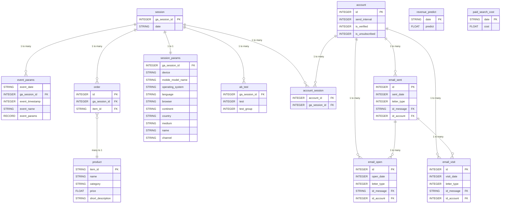

# Схема бази даних

## ERD діаграма

## Таблиці

| Таблиця | Опис |
|---|---|
| **session** | Головна таблиця. Кожен візит користувача = одна сесія з унікальним `ga_session_id`. |
| **session_params** | Деталі сесії: пристрій, країна, браузер, канал трафіку. |
| **event_params** | Всі дії користувача під час сесії (кліки, перегляди тощо). |
| **ab_test** | В які A/B тести потрапила сесія і в яку групу (1=A, 2=B). |
| **account** | Підписники які залишили email. |
| **account_session** | Зв'язкова таблиця між account і session. |
| **email_sent** | Всі надіслані листи. `sent_date` — кількість днів після створення акаунта. |
| **email_open** | Кожне відкриття листа. |
| **email_visit** | Кожен клік в листі. |
| **order** | Покупки. Кожен рядок = один куплений товар в сесії. |
| **product** | Довідник товарів: назва, категорія, ціна. |
| **revenue_predict** | План доходу компанії по датах. |
| **paid_search_cost** | Витрати на платний трафік по датах. |

## Інтерактивна схема

Повноцінна HTML-версія схеми доступна у файлі [../src/main/resources/static/db_schema_full.html](../src/main/resources/static/db_schema_full.html).

## Зв'язки між таблицями

| Тип зв'язку | Таблиці |
|---|---|
| 1:1 | `session` → `session_params` |
| 1:M | `session` → `event_params`, `session` → `order`, `session` → `ab_test` |
| 1:M | `account` → `email_sent`, `account` → `email_open`, `account` → `email_visit` |
| 1:M | `email_sent` → `email_open`, `email_sent` → `email_visit` |
| M:N | `account` ↔ `session` (через `account_session`) |
| M:1 | `order` → `product` |

## DDL створення таблиць (Liquibase міграції)

SQL-скрипти створення таблиць знаходяться в Liquibase міграціях:
[`../src/main/resources/db/changelog/common/2026/04/`](../src/main/resources/db/changelog/common/2026/04/)

| Файл | Таблиця | Що створює |
|---|---|---|
| [`V001__create_products_table.sql`](../src/main/resources/db/changelog/common/2026/04/V001__create_products_table.sql) | `products` | `item_id` (PK), `name`, `category`, `price`, `short_description` |
| [`V002__create_account_table.sql`](../src/main/resources/db/changelog/common/2026/04/V002__create_account_table.sql) | `account` | `id` (PK), `send_interval`, `is_verified`, `is_unsubscribed` |
| [`V003__create_sessions_table.sql`](../src/main/resources/db/changelog/common/2026/04/V003__create_sessions_table.sql) | `sessions` | `ga_session_id` (PK), `date` |
| [`V004__create_session_params_table.sql`](../src/main/resources/db/changelog/common/2026/04/V004__create_session_params_table.sql) | `session_params` | `ga_session_id` (FK), `device`, `browser`, `country`, `channel` тощо |
| [`V005__create_account_session_table.sql`](../src/main/resources/db/changelog/common/2026/04/V005__create_account_session_table.sql) | `account_session` | Зв'язка `account` ↔ `sessions`: `account_id` (FK), `ga_session_id` (FK) |
| [`V006__create_ab_test_table.sql`](../src/main/resources/db/changelog/common/2026/04/V006__create_ab_test_table.sql) | `ab_test` | `ga_session_id` (FK), `test`, `test_group` |
| [`V007__create_event_params_table.sql`](../src/main/resources/db/changelog/common/2026/04/V007__create_event_params_table.sql) | `event_params` | `ga_session_id` (FK), `event_timestamp`, `event_name`, `event_params` (JSONB) |
| [`V008__create_orders_table.sql`](../src/main/resources/db/changelog/common/2026/04/V008__create_orders_table.sql) | `orders` | `ga_session_id` (FK), `item_id` (FK → `products`) |
| [`V009__create_email_sent_table.sql`](../src/main/resources/db/changelog/common/2026/04/V009__create_email_sent_table.sql) | `email_sent` | `id_account` (FK), `sent_date`, `letter_type`, `id_message` |
| [`V010__create_email_open_table.sql`](../src/main/resources/db/changelog/common/2026/04/V010__create_email_open_table.sql) | `email_open` | `id_account` (FK), `open_date`, `letter_type`, `id_message` |
| [`V011__create_email_visit_table.sql`](../src/main/resources/db/changelog/common/2026/04/V011__create_email_visit_table.sql) | `email_visit` | `id_account` (FK), `visit_date`, `letter_type`, `id_message` |
| [`V012__create_paid_search_cost_table.sql`](../src/main/resources/db/changelog/common/2026/04/V012__create_paid_search_cost_table.sql) | `paid_search_cost` | `date`, `cost` |
| [`V013__create_revenue_predict_table.sql`](../src/main/resources/db/changelog/common/2026/04/V013__create_revenue_predict_table.sql) | `revenue_predict` | `date`, `predict` |

## SQL запити для виконання

Всі завдання знаходяться в папці [../sql/](../sql/) ([README](../sql/README.md)):

| Файл | Тема |
|---|---|
| [`01-basic.sql`](../sql/01-basic.sql) | Базові SELECT, JOIN, агрегація |
| [`02-case-when.sql`](../sql/02-case-when.sql) | CASE WHEN умови |
| [`03-union.sql`](../sql/03-union.sql) | UNION / UNION ALL |
| [`04-subquery.sql`](../sql/04-subquery.sql) | Підзапити |
| [`05-data.sql`](../sql/05-data.sql) | Робота з датами та інтервалами |
| [`06-window-functions.sql`](../sql/06-window-functions.sql) | Віконні функції |
| [`07-cte.sql`](../sql/07-cte.sql) | Common Table Expressions (WITH) |
| [`08_1-view.sql`](../sql/08_1-view.sql) | Представлення (VIEW) |
| [`08_2-temp.sql`](../sql/08_2-temp.sql) | Тимчасові таблиці |
| [`analytics.sql`](../sql/analytics.sql) | Аналітичні запити |
| [`email-funnel.sql`](../sql/email-funnel.sql) | Email воронка |
| [`orders.sql`](../sql/orders.sql) | Запити по замовленнях |
| [`products.sql`](../sql/products.sql) | Запити по товарах |
| [`sessions.sql`](../sql/sessions.sql) | Запити по сесіях |
