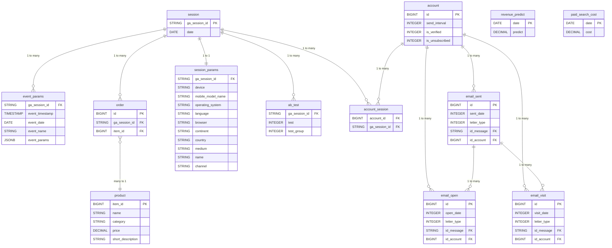

# Database Schema

## ERD Diagram

## Tables

| Table | Description |
|---|---|
| **session** | Main table. Each user visit = one session with a unique `ga_session_id`. |
| **session_params** | Session details: device, country, browser, traffic channel. |
| **event_params** | All user actions during a session (clicks, views, etc.). |
| **ab_test** | Which A/B tests the session was assigned to and which group (1=A, 2=B). |
| **account** | Subscribers who left their email. |
| **account_session** | Junction table between account and session. |
| **email_sent** | All sent emails. `sent_date` — number of days after account creation. |
| **email_open** | Each email open event. |
| **email_visit** | Each email click event. |
| **order** | Purchases. Each row = one product bought in a session. |
| **product** | Product catalog: name, category, price. |
| **revenue_predict** | Company revenue plan by date. |
| **paid_search_cost** | Paid traffic costs by date. |

## Interactive Schema

A full HTML version of the schema is available at [../src/main/resources/static/db_schema_full.html](../src/main/resources/static/db_schema_full.html).

## Table Relationships

| Relationship Type | Tables |
|---|---|
| 1:1 | `session` → `session_params` |
| 1:M | `session` → `event_params`, `session` → `order`, `session` → `ab_test` |
| 1:M | `account` → `email_sent`, `account` → `email_open`, `account` → `email_visit` |
| 1:M | `email_sent` → `email_open`, `email_sent` → `email_visit` |
| M:N | `account` ↔ `session` (via `account_session`) |
| M:1 | `order` → `product` |

## DDL Table Creation (Liquibase Migrations)

SQL scripts for table creation are located in Liquibase migrations:
[`../src/main/resources/db/changelog/common/2026/04/`](../src/main/resources/db/changelog/common/2026/04/)

| File | Table | Creates |
|---|---|---|
| [`V001__create_products_table.sql`](../src/main/resources/db/changelog/common/2026/04/V001__create_products_table.sql) | `products` | `item_id` (PK), `name`, `category`, `price`, `short_description` |
| [`V002__create_account_table.sql`](../src/main/resources/db/changelog/common/2026/04/V002__create_account_table.sql) | `account` | `id` (PK), `send_interval`, `is_verified`, `is_unsubscribed` |
| [`V003__create_sessions_table.sql`](../src/main/resources/db/changelog/common/2026/04/V003__create_sessions_table.sql) | `sessions` | `ga_session_id` (PK), `date` |
| [`V004__create_session_params_table.sql`](../src/main/resources/db/changelog/common/2026/04/V004__create_session_params_table.sql) | `session_params` | `ga_session_id` (FK), `device`, `browser`, `country`, `channel` etc. |
| [`V005__create_account_session_table.sql`](../src/main/resources/db/changelog/common/2026/04/V005__create_account_session_table.sql) | `account_session` | Junction `account` ↔ `sessions`: `account_id` (FK), `ga_session_id` (FK) |
| [`V006__create_ab_test_table.sql`](../src/main/resources/db/changelog/common/2026/04/V006__create_ab_test_table.sql) | `ab_test` | `ga_session_id` (FK), `test`, `test_group` |
| [`V007__create_event_params_table.sql`](../src/main/resources/db/changelog/common/2026/04/V007__create_event_params_table.sql) | `event_params` | `ga_session_id` (FK), `event_timestamp`, `event_name`, `event_params` (JSONB) |
| [`V008__create_orders_table.sql`](../src/main/resources/db/changelog/common/2026/04/V008__create_orders_table.sql) | `orders` | `ga_session_id` (FK), `item_id` (FK → `products`) |
| [`V009__create_email_sent_table.sql`](../src/main/resources/db/changelog/common/2026/04/V009__create_email_sent_table.sql) | `email_sent` | `id_account` (FK), `sent_date`, `letter_type`, `id_message` |
| [`V010__create_email_open_table.sql`](../src/main/resources/db/changelog/common/2026/04/V010__create_email_open_table.sql) | `email_open` | `id_account` (FK), `open_date`, `letter_type`, `id_message` |
| [`V011__create_email_visit_table.sql`](../src/main/resources/db/changelog/common/2026/04/V011__create_email_visit_table.sql) | `email_visit` | `id_account` (FK), `visit_date`, `letter_type`, `id_message` |
| [`V012__create_paid_search_cost_table.sql`](../src/main/resources/db/changelog/common/2026/04/V012__create_paid_search_cost_table.sql) | `paid_search_cost` | `date`, `cost` |
| [`V013__create_revenue_predict_table.sql`](../src/main/resources/db/changelog/common/2026/04/V013__create_revenue_predict_table.sql) | `revenue_predict` | `date`, `predict` |

## SQL Queries to Run

All tasks are located in the [../sql/](../sql/) folder ([README](../sql/README.md)):

| File | Topic |
|---|---|
| [`01-basic.sql`](../sql/01-basic.sql) | Basic SELECT, JOIN, aggregation |
| [`02-case-when.sql`](../sql/02-case-when.sql) | CASE WHEN conditions |
| [`03-union.sql`](../sql/03-union.sql) | UNION / UNION ALL |
| [`04-subquery.sql`](../sql/04-subquery.sql) | Subqueries |
| [`05-data.sql`](../sql/05-data.sql) | Working with dates and intervals |
| [`06-window-functions.sql`](../sql/06-window-functions.sql) | Window functions |
| [`07-cte.sql`](../sql/07-cte.sql) | Common Table Expressions (WITH) |
| [`08_1-view.sql`](../sql/08_1-view.sql) | Views (VIEW) |
| [`08_2-temp.sql`](../sql/08_2-temp.sql) | Temporary tables |
| [`analytics.sql`](../sql/analytics.sql) | Analytical queries |
| [`email-funnel.sql`](../sql/email-funnel.sql) | Email funnel |
| [`orders.sql`](../sql/orders.sql) | Order-related queries |
| [`products.sql`](../sql/products.sql) | Product-related queries |
| [`sessions.sql`](../sql/sessions.sql) | Session-related queries |
