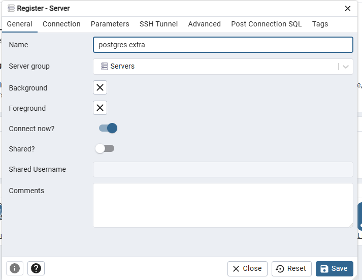
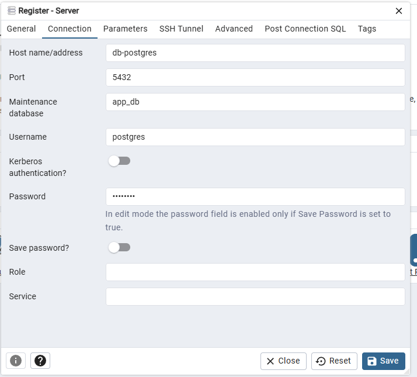
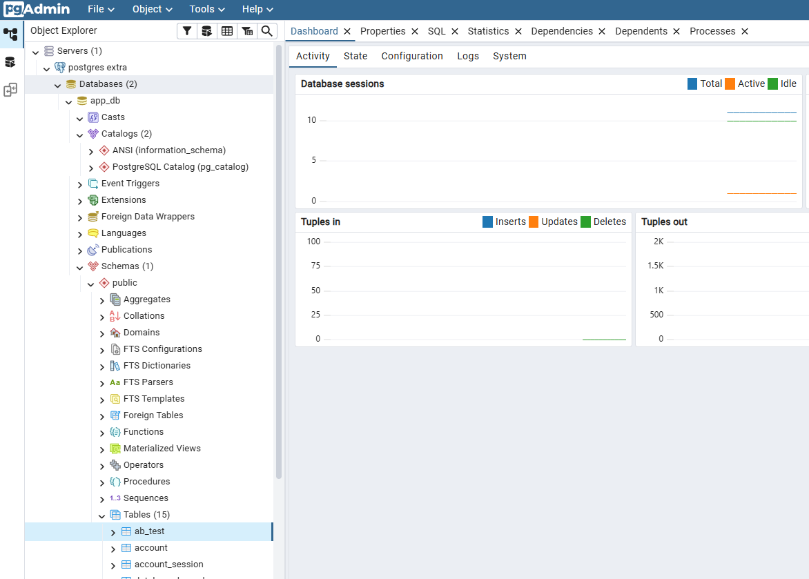

# Installation Guide

## Requirements

- **Git** — clone the repository
- **Docker** and **Docker Compose** — run the project

Commands are executed in the terminal (PowerShell, cmd, or bash):

```bash
git clone https://github.com/ArtemMakovskyy/sql-extra.git
cd sql-extra
```

Install Docker:
- [Windows](https://docs.docker.com/desktop/setup/install/windows-install/)
- [macOS](https://docs.docker.com/desktop/setup/install/mac-install/)
- [Linux](https://docs.docker.com/desktop/setup/install/linux/)

## Startup

```bash
docker compose up -d
```

After startup:
- PostgreSQL is available on port `5434`
- The application is available at `http://localhost:8080`

## How to Run SQL Queries via pgAdmin

Open **pgAdmin** in the browser: `http://localhost:5050`

**Login:** `admin@admin.com`
**Password:** `admin`

### Server Connection



Fill in the fields:
- **Host:** `db-postgres`
- **Port:** `5432`
- **Database:** `app_db`
- **Username:** `postgres`
- **Password:** `postgres`
- 


### Selecting the Database

After connecting, find the `app_db` database in the list:


### Running Queries

Open **Query Tool** (right-click on `app_db` → Query Tool) and run queries from the [`../sql/`](../sql/) folder.

## Shutdown

```bash
docker compose down
```

This command stops and removes containers. If you also need to remove volumes (all DB data):

```bash
docker compose down -v
```

## Troubleshooting

| Problem | Solution |
|---|---|
| `port is already allocated` | Change the port in `docker-compose.yaml` or stop the process using the port |
| `app` container crashes | Check if `db-postgres` started: `docker compose logs db-postgres` |
| pgAdmin won't connect | Use Host = `db-postgres` (not `localhost`), because containers are on the same network |
| Data not generated | Check `.env` variables; DataSeeder runs automatically on first startup |

## What Happens on Startup

1. **Liquibase** creates tables in the database
2. **DataSeeder** populates tables with test data
